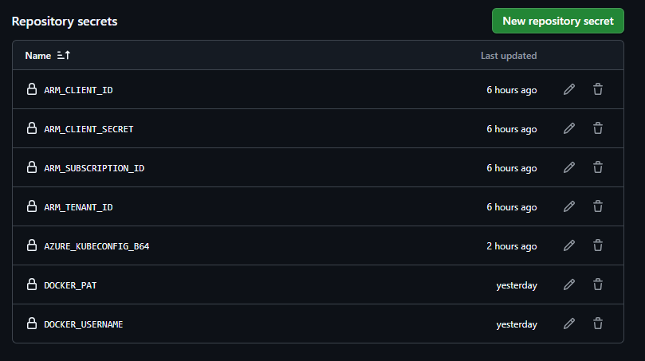
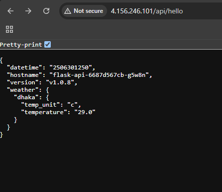
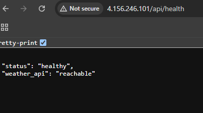

# Weather api app on AKS with CI/CD and Observability

This project build the api app docker image and push in docker hub and provisining the AKS cluster infrastructure using fully automated **terraform** pipeline for , deploy the app in the aks cluster and with automated pipeline and deploy **Grafana + Prometheus** for observability.

---
## Project Structure

## 🚀 Release & Deploy Workflow
set the folling secrets in github project 

### 🔁 Step 1: Create a New Release (e.g. `v1.0.9`)

1. Push your latest changes (including updated `version.txt`) to `main`
2. Go to [Releases](https://github.com/<your-username>/<your-repo>/releases)
3. Click **"Draft a new release"**
4. Tag version: `v1.0.9`
5. Release title: `v1.0.9`
6. Click **"Publish release"**

> ✅ This triggers a GitHub Actions "Build & Docker Push" workflow that: 
> - Builds and tags the Docker image
    https://github.com/minhaznub/BS23-CICD/actions/workflows/release-build.yml
> - Pushes it to Docker Hub as [`minhajulcse7/weatherapp:v1.0.9`](https://hub.docker.com/repository/docker/minhajulcse7/weatherapp/tags)

---

### ☁️ Step 2: Provision AKS Infrastructure (Once)

This creates the AKS cluster and required network using Terraform.

1. Go to GitHub Actions → Run workflow: **"Terraform AKS Infrastructure"**
2. Input `action = apply` and click **Run**
3. Terraform provisions:
   - Resource Group
   - AKS Cluster
   - Networking

Secrets needed:
- `ARM_CLIENT_ID`, `ARM_CLIENT_SECRET`, `ARM_SUBSCRIPTION_ID`, `ARM_TENANT_ID`

---

### 🐳 Step 3: Deploy the App to AKS

1. Run the GitHub Actions workflow: **"Deploy app to AKS"**
2. The workflow will:
   - Fetch the latest release tag (`v1.0.9`)
   - Patch `deployment.yaml` with the correct image tag
   - Apply manifests in `k8s_manifest/`
   - Wait for zero-downtime rolling update to finish

Make sure the GitHub secret `AZURE_KUBECONFIG_B64` (base64 of kubeconfig) is configured.

after the pipeline **"Deploy app to AKS"** succeeded . 
visit aks cluster http://<EXTERNAL-IP of "flask-api-servie"> /api/hello

For health: visit
http://<EXTERNAL-IP of "flask-api-servie"> /api/health

---

## 📊 Observability Setup (Prometheus + Grafana)

> Automatically deployed with the GitHub Actions workflow: **"Deploy Observability Stack"**

Copy the EXTERNAL-IP of grafana-service

Visit: http://<EXTERNAL-IP>

Login:
Username: admin
Password: supersecurepassword123

### Dashboards Included:
- Request count
- Request duration
- Status breakdown

